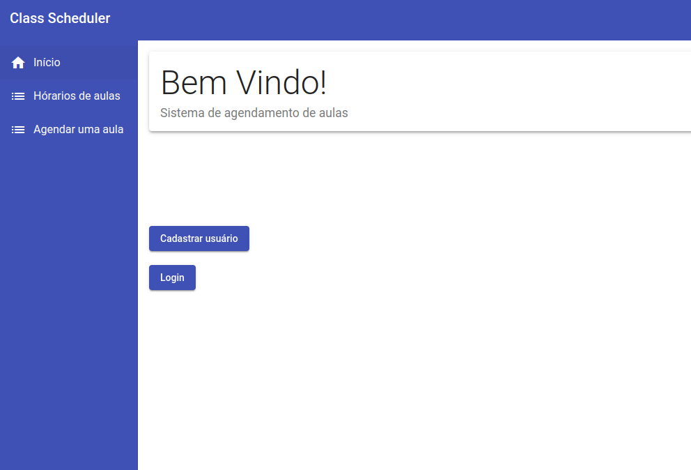
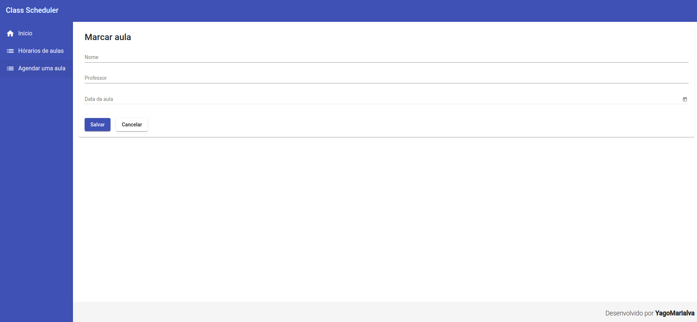
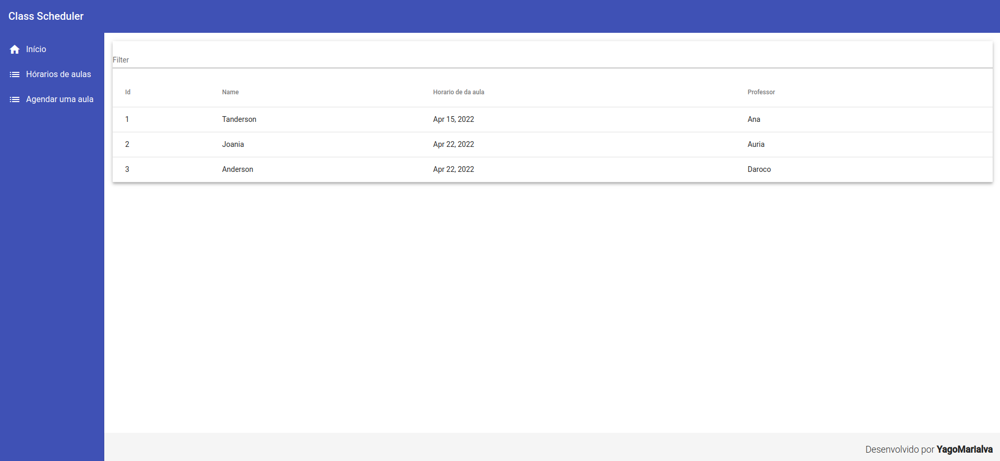

# Agenda de cadastro de aulas
> Projeto desenvolvido para exibição de Crud por Yago Marialva Bentes.

O Sistema Agenda de cadastro de aulas é um projeto desenvolvido em angular para aplicação dos conceitos de criar e ler dados

## Instalação

O projeto é composto de duas partes: o frontend em angular(principal) e o backend em java spring boot.
Para instalar o frontend, somente é necessário utilizar o comando:
`npm install` 

Para o backend, deve-se clonar o repositório:
`https://github.com/yagomarialva/class-schedule-backend` 

## Exemplo de uso

O Sistema cadastra as aulas desejadas pelo aluno:

Para consultar as aulas:

## Histórico de lançamentos

* 0.0.1
    * Primeira interação do sistema

## Meta

Yago Marialva Bentes – yago.marialva@gmail.com

[https://github.com/yagomarialva](https://github.com/yagomarialva)

## Contributing

1. Faça o _fork_ do projeto (<https://github.com/yagomarialva/portifolio-site/fork>)
2. Crie uma _branch_ para sua modificação (`git checkout -b feature/fooBar`)
3. Faça o _commit_ (`git commit -am 'Add some fooBar'`)
4. _Push_ (`git push origin feature/fooBar`)
5. Crie um novo _Pull Request_
